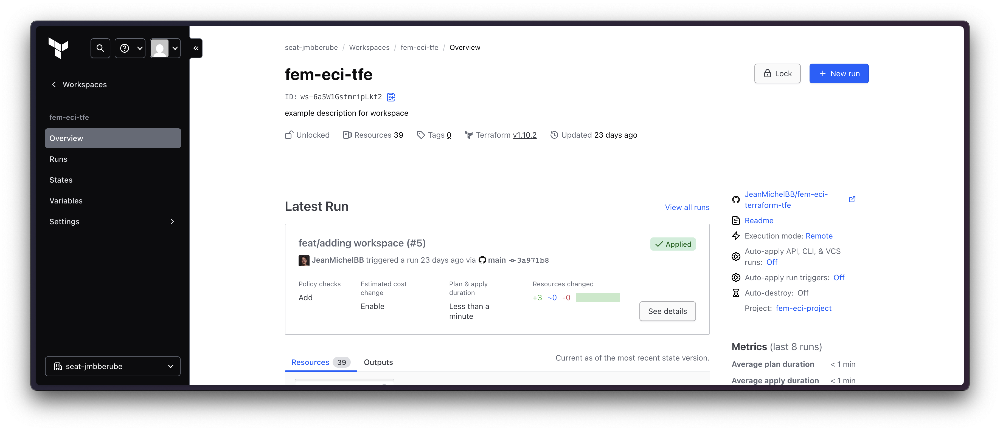

# fem-eci-terraform-tfe


## Overview
This repository manages Terraform configurations for controlling infrastructure on GitHub using Terraform Cloud (TFE).

## Modules Used
- **Project Module** (`ALT-F4-LLC/project/tfe`): Defines and manages Terraform Cloud projects.
- **Workspace Module** (`ALT-F4-LLC/workspace/tfe`): Manages Terraform Cloud workspaces and integrates with GitHub.

## Key Features
- Automates Terraform Cloud workspace and project creation.
- Uses version-controlled configurations stored in this repository.
- Integrates with GitHub via Terraform Cloud’s VCS connection.

## Configuration
- Define projects in `local.project` and workspaces in `local.workspace`.
- Configure GitHub repository integration via `vcs_repo` in the `workspace` module.

## Moving Resources
- Resource migrations are handled via the `moved` block, ensuring smooth transitions between workspaces.

## Requirements
- Terraform 1.x
- Terraform Cloud (TFE) account
- GitHub integration enabled for Terraform Cloud

## Usage
1. Clone the repository:
   ```sh
   git clone https://github.com/your-org/fem-eci-terraform-tfe.git
   cd fem-eci-terraform-tfe
   ```
2. Initialize Terraform:
   ```sh
   terraform init
   ```
3. Plan and apply changes:
   ```sh
   terraform plan
   terraform apply
   ```

## License
This project is licensed under [MIT License](LICENSE).